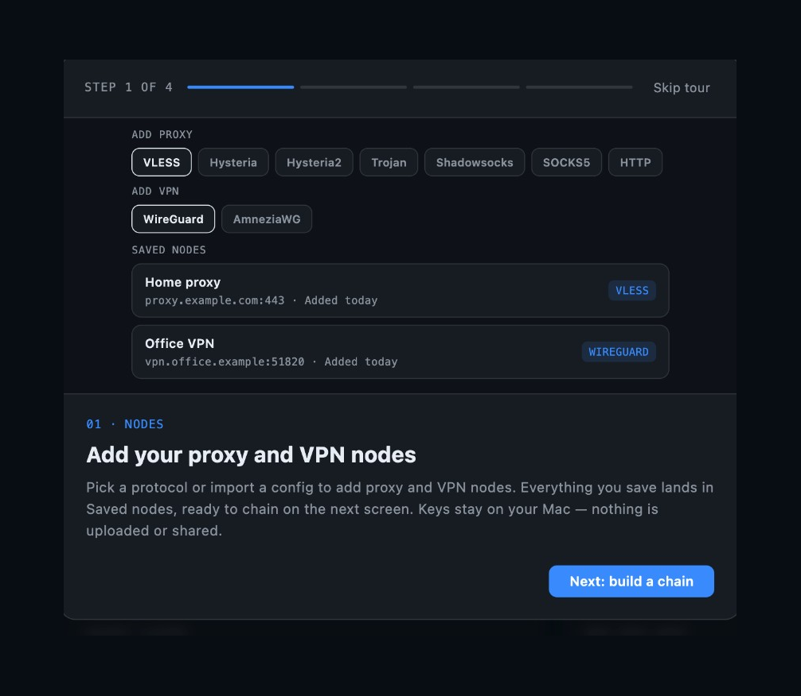
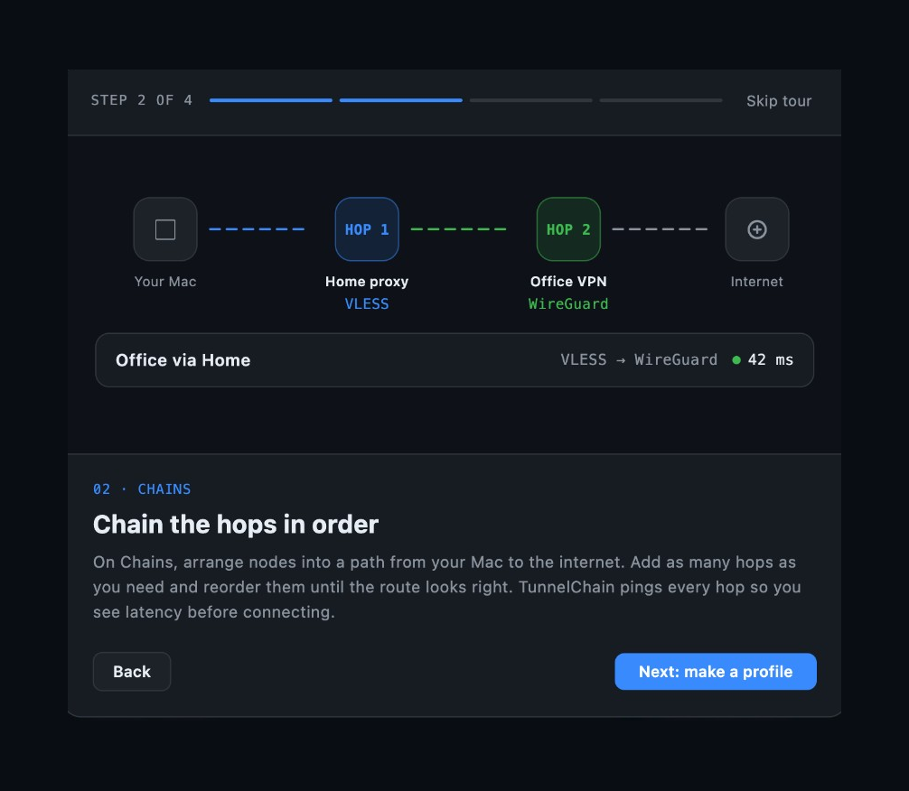
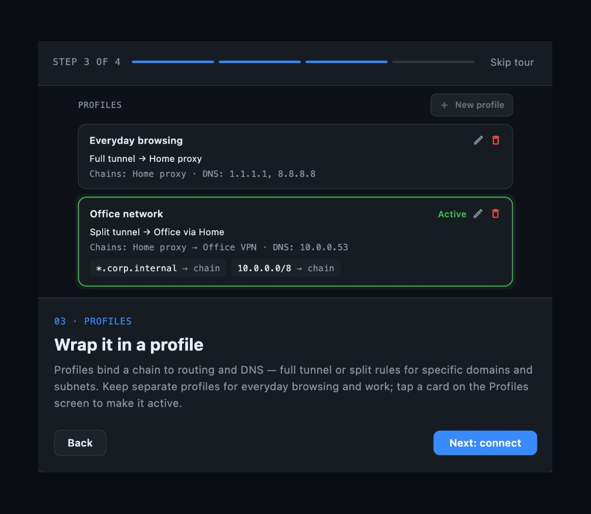
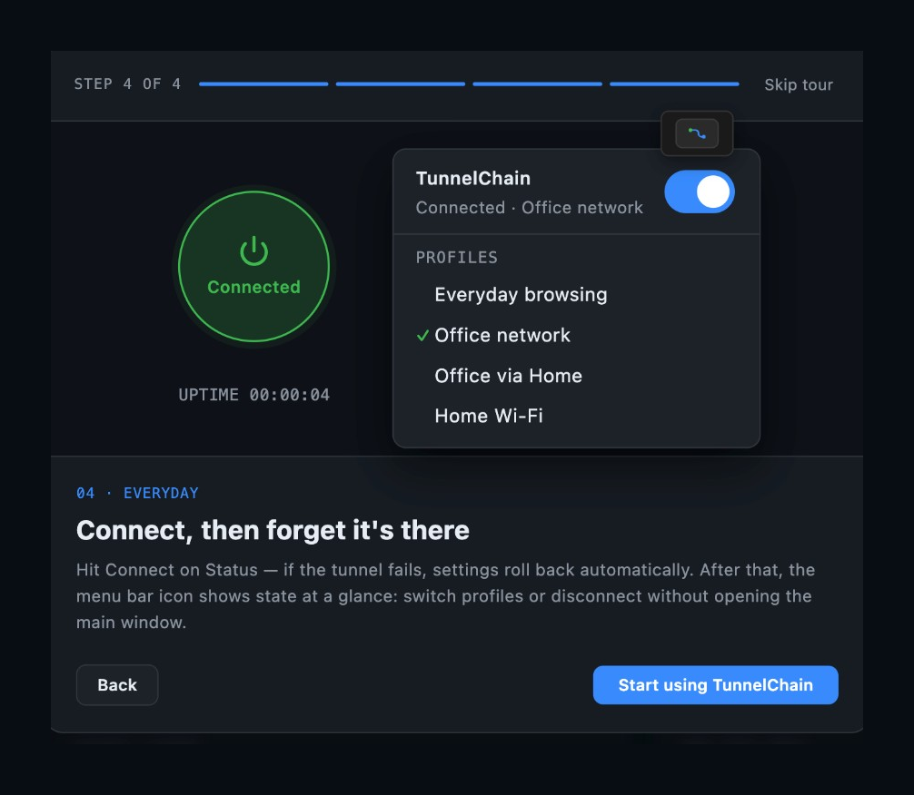

# TunnelChain

**macOS app for VPN tunnel chains: split routing, sing-box config generation, and safe rollback.**

TunnelChain is a native macOS application that manages nested VPN and proxy tunnels from a single place. You define **nodes** (endpoints), compose them into **chains** (ordered hops), and attach **profiles** (routing + DNS rules). The app generates a [sing-box](https://github.com/SagerNet/sing-box) configuration, brings up one TUN interface, and monitors the connection.

> **Status:** 1.0.0 — macOS only.

---

## Table of contents

- [Why TunnelChain exists](#why-tunnelchain-exists)
- [What it does](#what-it-does)
- [Screenshots](#screenshots)
- [Core concepts](#core-concepts)
- [Features](#features)
- [Architecture](#architecture)
- [Requirements](#requirements)
- [Getting started](#getting-started)
- [Project structure](#project-structure)
- [Documentation](#documentation)
- [Roadmap](#roadmap)
- [Design decisions](#design-decisions)
- [External dependencies](#external-dependencies)
- [License](#license)

---

## Why TunnelChain exists

Standard macOS VPN clients do not cooperate well with each other:

- Each client creates its own `utun` and fights for the default route.
- Each client rewrites system DNS independently.
- WireGuard tooling must exclude its own endpoint from the tunnel, which makes **nesting** one tunnel inside another impossible across two separate apps.
- An unclean shutdown can leave proxies, DNS, or `pf` rules behind.

TunnelChain addresses this with **one core process**, **one TUN**, and **one owner of routes and DNS**. Chains can stack protocols (for example, an inner hop encapsulated by an outer hop), and routing decides which traffic uses which chain.

```
Application traffic
 └─ inner hop   (e.g. WireGuard)
     └─ outer hop   (e.g. VLESS / REALITY)
         └─ transport to remote endpoint
```

---

## What it does

1. **Import** proxy and VPN endpoints (VLESS links, sing-box/Xray JSON, WireGuard `.conf`).
2. **Build chains** — ordered hop lists where each hop is encapsulated inside the previous one.
3. **Configure profiles** — default route, override rules (CIDR, domain suffix, …), and DNS policy.
4. **Connect** — generate `config.json`, start sing-box via a privileged helper, arm auto-rollback.
5. **Observe** — status, traffic, logs, packet-layer visualization, and routing summary.

Closing the window hides the app to the menu bar; quitting restores network settings.

---

## Screenshots

Onboarding tour (demo data — no real endpoints):

| Nodes | Chains |
|-------|--------|
|  |  |

| Profiles | Connect |
|----------|---------|
|  |  |

To regenerate after UI changes:

```bash
# 1. Capture windows manually (or use tool/capture_readme_screenshots.sh on macOS)
# 2. Normalize padding and size:
python3 tool/normalize_readme_screenshots.py docs/screenshots \
  01-nodes:path/to/nodes.png \
  02-chains:path/to/chains.png \
  03-profiles:path/to/profiles.png \
  04-connect:path/to/connect.png
```

---

## Core concepts

TunnelChain separates **how a channel is built** from **what traffic uses it**.

| Concept | Meaning | Example |
|---------|---------|---------|
| **Node** | A single endpoint (VLESS or WireGuard) | `nl.example.com:443` |
| **Chain** | Ordered hops, outer → inner | `VLESS → WireGuard` |
| **Profile** | Routing + DNS that references chains | default: chain A; `.corp` → chain B |
| **Active profile** | The profile used on connect | selected in UI or menu bar |

There is no hard-coded “full tunnel” or “split tunnel” mode. That behaviour emerges from which chain is the default route and which override rules exist.

### Validation rules

- A chain cannot contain two hops of the same protocol (e.g. `VLESS → VLESS`).
- A chain cannot reference itself, directly or transitively.
- Routing rules must reference existing chains.

---

## Features

### Nodes

- Import **VLESS** from `vless://` URIs or sing-box / Xray outbound JSON
- Supported VLESS transports: **TCP**, **gRPC**, **WebSocket**, **HTTP/2**, **HTTPUpgrade**
- Security: **TLS** and **REALITY**
- Import **WireGuard** from `.conf` (AmneziaWG obfuscation detected; full generator support planned)
- Secrets stored in **macOS Keychain**, not in plain JSON

### Chains

- Create named chains with 1–N hops
- Visual hop composition on the Chains screen
- Protocol-uniqueness validation before save

### Profiles (routing & DNS)

- **Full tunnel** preset: one chain as default, no overrides
- **Split routing**: ordered override rules (IP CIDR, domain suffix, …)
- Per-profile public DNS resolver; optional per-rule DNS for domain suffixes
- **Import / export** profiles (JSON bundle with chains and node references)
- **Clone** a profile and edit before saving

### Status & control

- Connect / disconnect with confirmation countdown and auto-rollback
- Profile picker on Status and in the menu bar
- **Packet layers** — hop stack and encapsulation per routing target (default + overrides)
- **Who sees what** — visibility summary for the active chain
- Live traffic sparkline and sing-box log stream

### macOS integration

- Menu bar icon with profile list and **connect switch**
- Privileged helper (`SMAppService`) for DNS, routes, and core lifecycle
- Rounded window chrome; close button hides instead of quitting

### Not yet available

- Subscription URL import (`https://…`)
- Hysteria2, Trojan, Shadowsocks, SOCKS, AmneziaWG connect
- Full diagnostics suite (leak check, MTU tuner, speed test)
- iOS / Android

See [docs/ROADMAP.md](docs/ROADMAP.md) for the full plan.

---

## Architecture

```
┌─────────────────────────────────────────────────────────┐
│  Flutter UI (no root)                                   │
│  Riverpod state · domain models · config generator      │
└───────────────┬─────────────────────────┬───────────────┘
                │ XPC                     │ REST / WS
┌───────────────▼──────────────┐  ┌───────▼───────────────┐
│  Privileged helper (root)    │  │  sing-box (GPL-3.0)   │
│  DNS · routes · pf · watchdog│  │  TUN · routing · DNS  │
└──────────────────────────────┘  └───────────────────────┘
```

| Layer | Responsibility |
|-------|----------------|
| **UI** | Screens, dialogs, chain visualization |
| **State** (Riverpod) | Catalogs, tunnel session, connect bundle |
| **Domain** | `Profile`, `Chain`, `RoutingPolicy`, `DnsPolicy` — no sing-box JSON |
| **ConfigGenerator** | Domain → sing-box `config.json` (single source of truth) |
| **PrivilegedHelper** | System network changes, core start/stop, timed rollback |
| **sing-box** | Separate process; GPL boundary preserved |

The GUI never links against sing-box. Secrets never appear in generated config files on disk beyond what the core requires at runtime.

Full diagrams, data model, and packet-path details: [docs/AR.md](docs/AR.md).

---

## Requirements

- **macOS** (developed and tested on recent macOS versions)
- **Flutter** SDK `^3.12`
- **Xcode** command-line tools (for macOS build and Swift helper)
- **sing-box** binary available to the helper (see project setup / helper docs)
- Administrator approval for the privileged helper on first connect

---

## Getting started

### Clone and run

```bash
git clone <repository-url>
cd TunnelChain
flutter pub get
flutter run -d macos
```

### First launch

1. Complete the onboarding tour (optional).
2. **Nodes** — import at least one VLESS or WireGuard endpoint.
3. **Chains** — create a chain that references your nodes.
4. **Profiles** — create a profile, set default route and overrides if needed.
5. **Status** — register the privileged helper if prompted, then connect.

### Native code changes

Swift changes (menu bar, window chrome, helper) require a **full rebuild**:

```bash
flutter run -d macos
# or
flutter build macos
open build/macos/Build/Products/Debug/TunnelChain.app
```

Hot reload does not apply to native macOS code.

### Tests

```bash
flutter test
```

---

## Project structure

```
lib/
├── app/              # Theme, router
├── core_config/      # sing-box config generator
├── domain/           # Models, parsers, validators, codecs
├── services/         # Stores, helper client, import/transfer
├── state/            # Riverpod providers
└── ui/               # Screens, dialogs, widgets

macos/
├── Runner/           # Flutter host, menu bar, channels
└── Helper/           # Privileged SMAppService daemon

docs/
├── FR.md             # Functional requirements
├── AR.md             # Architecture
├── ADR.md            # Architecture decision records
└── ROADMAP.md        # Product roadmap

test/                 # Unit and integration tests
```

---

## Documentation

| Document | Contents |
|----------|----------|
| [docs/FR.md](docs/FR.md) | Functional requirements with acceptance criteria |
| [docs/AR.md](docs/AR.md) | Architecture, component diagram, data model |
| [docs/ADR.md](docs/ADR.md) | Design decisions and trade-offs |
| [docs/ROADMAP.md](docs/ROADMAP.md) | Planned features by phase |

**Suggested reading order:** README → FR → AR → ADR.

---

## Roadmap

| Phase | Focus | Status |
|-------|-------|--------|
| **1** | VLESS multi-transport, Xray JSON import | largely done |
| **2** | Subscription URL import | planned |
| **3** | AmneziaWG, Hysteria2, Trojan, Shadowsocks, … | planned |
| **4** | Profile picker, import/export, clone | largely done |

Out of scope for now: subscription auto-update, load balancers, mobile clients.

---

## Design decisions

| Decision | Rationale |
|----------|-----------|
| Independent app, not a Hiddify fork | Different goals; licence constraints |
| sing-box as separate process | GPL isolation; upgrade by binary swap |
| `SMAppService` helper | Privileges without Network Extension / Apple Developer Program |
| Chains ⊥ routing | Reusable channels; routing is a separate concern |
| Default chain often single-hop | Nested default route can cause TCP-over-TCP instability |
| MTU 1280 default | Higher calculated MTU failed in practice |
| Timed auto-rollback | Bad config should not brick connectivity |
| Quit restores network | Deliberate exit is fail-open; crash is fail-closed |

Details and evidence: [docs/ADR.md](docs/ADR.md).

---

## External dependencies

| Component | Licence | Role |
|-----------|---------|------|
| [sing-box](https://github.com/SagerNet/sing-box) | GPL-3.0 | Core: TUN, routing, DNS, protocols |
| [sing-box-lx](https://github.com/Leadaxe/sing-box-lx) | GPL-3.0 | Optional: AmneziaWG 2.0 and extended transports |
| Flutter | BSD-3-Clause | UI framework |

---

## License

TunnelChain application code is licensed under the [MIT License](LICENSE).

[sing-box](https://github.com/SagerNet/sing-box) is licensed under **GPL-3.0** and runs as a separate process. See [THIRD_PARTY_NOTICES.md](THIRD_PARTY_NOTICES.md) for source retrieval instructions.
