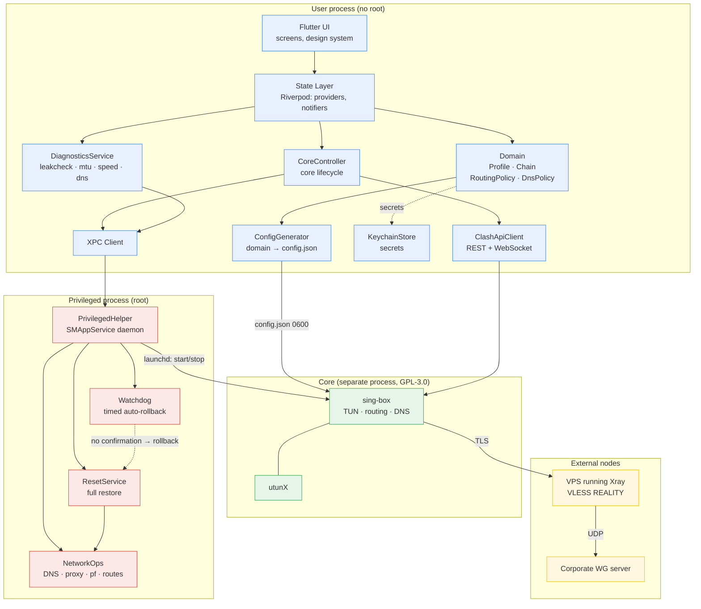
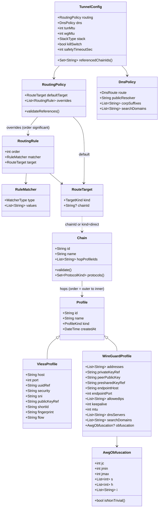
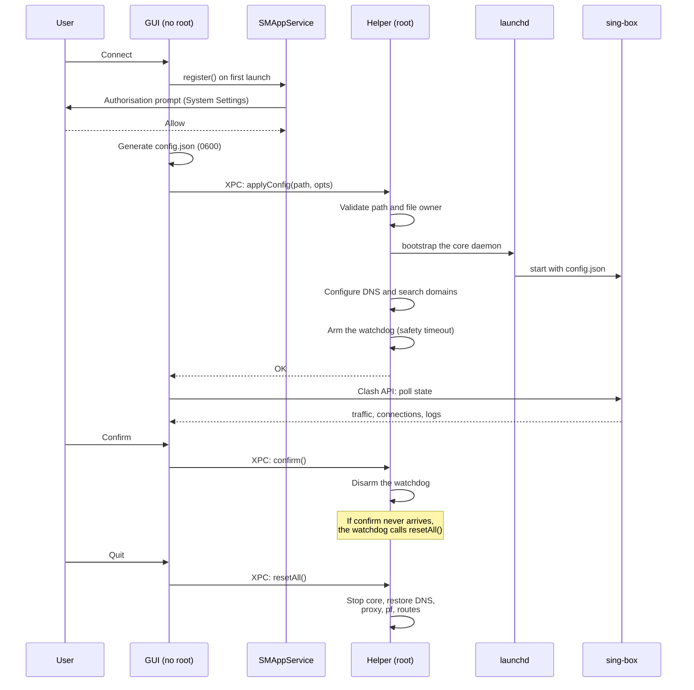
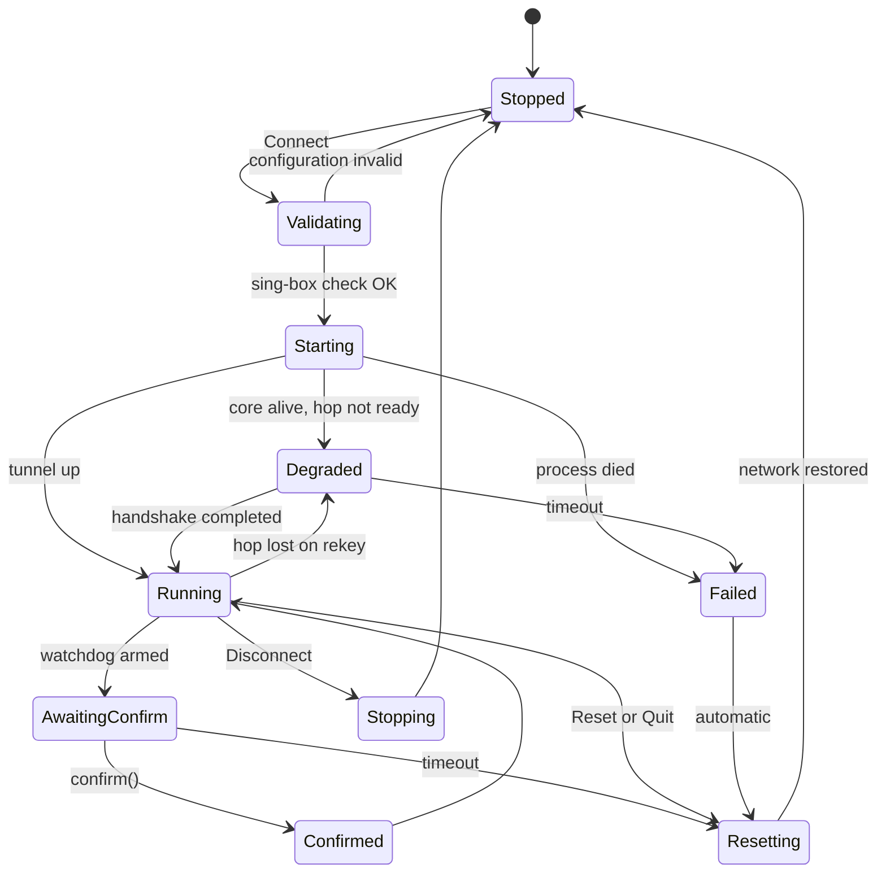

# AR — Architecture

**Project:** TunnelChain (working name)
**Related documents:** [FR.md](FR.md) · [ADR.md](ADR.md)

---

## 1. Architectural principles

| Principle | Consequence |
|---|---|
| **Core runs as a separate process** | The core (`sing-box`, GPL-3.0) is launched as an independent process. The application communicates with it through a configuration file and a REST API; it does not link against it. This provides licence independence ([ADR-002](ADR.md#adr-002)) and resilience: a core crash does not take down the UI. |
| **Single owner of the network** | Exactly one TUN interface, one set of routes, one owner of DNS. No concurrent operation with other VPN clients. |
| **Least privilege** | The GUI runs without root. All privileged operations live in a separate helper daemon exposing a narrow, fixed set of commands. |
| **Fail-safe by default** | Every configuration change is reversible and armed with auto-rollback. Network state is restored without user intervention. |
| **Platform layer is isolated** | Business logic (profiles, chains, configuration generation) knows nothing about macOS. Porting to Windows/Linux replaces only the helper implementation and the way the TUN is created. |
| **Chains are orthogonal to routing** | A chain describes *how a channel is built* and knows nothing about traffic. Routing describes *what goes where* and references chains. There is no full/split concept in the model — that is a consequence of which chain is designated default ([ADR-012](ADR.md#adr-012)). |
| **Deliberate exit restores the system** | Quitting the application returns network configuration to its pre-launch state. Fail-closed applies to unexpected core death; a deliberate exit is fail-open (FR-25). |

---

## 2. Component diagram



**Trust boundaries.** The blue block has no authority to change the network — it can only request changes. The red block executes a predefined set of operations and never accepts arbitrary commands. The green block is isolated both by process and by licence.

`ResetService` is a single implementation shared by four callers: the explicit user control, application quit, the watchdog, and the helper's own teardown. One code path guarantees that all of them restore the same set of settings.

---

## 3. Layers and responsibilities

| Layer | Responsibility | Does not do |
|---|---|---|
| **UI** (Flutter widgets) | Rendering, input, visualisation of chains and packet layers | Contains no routing logic |
| **State** (Riverpod) | Application state, reaction to core events | Does not generate configuration |
| **Domain** | Models `Profile`, `Chain`, `RoutingPolicy`, `DnsPolicy`; chain validation (protocol uniqueness, cycles) and rule reference integrity; AWG obfuscation detection | Knows nothing about the core's JSON |
| **ConfigGenerator** | The single place where the domain is turned into core configuration | Does not talk to processes |
| **CoreController** | Start/stop/restart of the core, state tracking | Does not modify system settings directly |
| **ClashApiClient** | Traffic, connections, logs, version — over REST/WS | Does not manage routes |
| **DiagnosticsService** | Checks FR-18…FR-23, verdicts | Does not repair the system itself |
| **PrivilegedHelper** | DNS, proxy, `pf`, routes, launchd, watchdog, reset | Does not parse user input |

**Dependency rule:** UI → State → Domain. The domain depends on nothing platform-specific. `ConfigGenerator` depends only on the domain.

---

## 4. Data model



**Key modelling decisions:**

- **`Chain` carries no mode and knows nothing about routing.** It is purely a channel description: a name plus an ordered hop list. Orthogonality of chains and routing is mandated by [ADR-012](ADR.md#adr-012).
- **`RoutingPolicy` is the only place where "what goes where" is decided**: a `defaultTarget` plus ordered `overrides`. There is no full/split field; those arrangements are expressed by the choice of `defaultTarget` — a WireGuard chain yields full-tunnel behaviour, a VLESS chain yields split. Presets (FR-12) are factories that populate `RoutingPolicy`, not a field inside it.
- **`RouteTarget`** points either at a chain or at `direct`. Consequently an "exclusion" (home LAN direct) is an ordinary rule, not a special entity.
- `Chain.protocols()` returns the set of hop protocols; protocol-uniqueness validation (FR-8) is built on it — if the set is smaller than the hop count, a protocol repeats.
- `TunnelConfig.referencedChainIds()` serves the generator: only chains that something references reach the core configuration. Unreferenced chains exist in the application without bloating the config.
- `*Ref` fields hold Keychain record references, never secret values.
- `Chain.hopProfileIds` is ordered, which supports N hops (FR-7) with no schema change.
- `AwgObfuscation.isNonTrivial()` places the FR-3 logic in the domain rather than the UI.

**Invariants checked before configuration is generated:**

| Invariant | Checked in |
|---|---|
| Hop protocols within a chain are unique | `Chain.validate()` |
| No profile repeats within a chain | `Chain.validate()` |
| Chain is non-empty, all profiles exist | `Chain.validate()` |
| Every `RouteTarget.chainId` refers to an existing chain | `RoutingPolicy.validateReferences()` |
| `order` values in `overrides` are unique | `RoutingPolicy.validateReferences()` |

---

## 5. Mapping the domain onto core configuration

This is the heart of the system: `ConfigGenerator` is the only component that knows `sing-box` syntax.

### 5.1 Entity mapping

| Domain | Core configuration |
|---|---|
| Chain hop: VLESS | `outbounds[]` with `type: vless`, tag `<chainId>-hop<N>` |
| Chain hop: WG/AWG | `endpoints[]` with `type: wireguard`, tag `<chainId>-hop<N>` |
| Link between hops within a chain | `detour` on hop N points at the tag of hop N−1 |
| `RoutingPolicy.defaultTarget` | `route.final` = tag of the **last** hop of the target chain (or `direct`) |
| `RoutingPolicy.overrides[]` | `route.rules[]`, in the same order; `outbound` = tag of the target chain's last hop |
| DNS policy | `dns.servers[]` plus `dns.rules[]` |
| TUN | `inbounds[]` with `type: tun`, `auto_route`, `strict_route` |
| Observability | `experimental.clash_api.external_controller` |

**Chain addressing rule.** The outside world (routing rules, `route.final`) always references the **last** hop of a chain — the one closest to the application. Other hops are reachable only through `detour`. This way one chain is addressed identically from the default and from any rule.

**On `allowed_ips` of a WireGuard hop.** The value depends not on any "mode" but on what traffic can enter the chain. If the chain is the `defaultTarget`, anything may arrive, so `allowed_ips: ["0.0.0.0/0"]`. If only rules reference the chain, the union of their CIDRs plus the corporate DNS address suffices. The generator computes this set itself by walking `RoutingPolicy`; no manual configuration is required.

This is safe because hop packets leave through `detour`, bypassing the routing table, so no routing loop can form — unlike `wg-quick`, which must add a host route to its endpoint.

### 5.2 The nesting invariant

Nesting is achieved **solely** through the `detour` field on an inner hop. This is not an emulation but a native mechanism: the hop's traffic, handshake included, leaves via the specified outbound, bypassing the routing table.

**Experimental confirmation** (prototype log):

```
endpoint/wireguard[corp-awg]: failed to send handshake initiation:
  dial tcp <VPS>:443: connect: connection refused
```

To send its handshake, WireGuard performs a **TCP dial to the VLESS server** — literal proof of encapsulation. On the server side, `inbound packet connection to <wg-port>` appears simultaneously.

### 5.3 Mandatory generator invariants

The generator must never emit a configuration that violates these rules:

1. **DNS rule order.** DNS interception comes first, matched by address and port, then sniffing, then protocol-based interception:

   ```json
   [
     { "ip_cidr": ["172.19.0.2/32"], "port": [53], "action": "hijack-dns" },
     { "action": "sniff" },
     { "protocol": "dns", "action": "hijack-dns" }
   ]
   ```

   A `protocol: dns` rule works only in combination with `sniff`. Without the first rule and without `sniff`, DNS queries fall through to `route.final` and loop.

2. **At least three DNS servers.** A public DoH resolver, a resolver reached through the outer hop, and a bootstrap resolver. Otherwise a circular dependency forms.

3. **`domain_resolver` on hops.** The outer hop uses bootstrap. An inner hop uses a resolver that travels through the outer hop — never one that travels through the inner hop itself.

4. **`auto_detect_interface: true`** — otherwise the outer hop's outbound connection is routed back into the TUN, forming a loop.

5. **Reverse zones.** `*.in-addr.arpa` is directed to the corporate resolver, otherwise reverse lookups of internal addresses fail.

### 5.4 Reference example: two chains, default on VLESS

The domain from which the configuration below is derived:

- chain **«VPS»** = [VLESS] → tag `vps-hop0`;
- chain **«Corp via VPS»** = [VLESS, WireGuard] → tags `corp-hop0` (reusing the same VLESS profile) and `corp-hop1`;
- `defaultTarget` = «VPS»; overrides: corporate CIDRs and suffixes → «Corp via VPS», home LAN → `direct`.

For brevity both VLESS hops are collapsed into a single outbound named `vless-out`, and the WireGuard hop is named `corp-wg` — the generator may reuse one outbound when the profile and chain position coincide.

```json
{
  "dns": {
    "servers": [
      { "type": "https", "tag": "dns-public",    "server": "1.1.1.1",        "detour": "vless-out" },
      { "type": "https", "tag": "dns-via-vless", "server": "1.1.1.1",        "detour": "vless-out" },
      { "type": "local", "tag": "dns-bootstrap" },
      { "type": "udp",   "tag": "dns-corp",      "server": "10.0.0.53",  "detour": "corp-wg" }
    ],
    "rules": [
      { "domain_suffix": ["corp.internal", "internal.example"], "server": "dns-corp" },
      { "domain_suffix": [".in-addr.arpa"],        "server": "dns-corp" }
    ],
    "final": "dns-public",
    "strategy": "ipv4_only"
  },
  "endpoints": [
    {
      "type": "wireguard", "tag": "corp-wg",
      "address": ["10.0.0.2/32"],
      "private_key": "<from Keychain>",
      "mtu": 1280,
      "domain_resolver": "dns-via-vless",
      "peers": [{
        "address": "vpn.corp.example", "port": 51820,
        "public_key": "<...>", "pre_shared_key": "<from Keychain>",
        "allowed_ips": ["10.0.0.0/8", "172.20.0.0/16", "10.0.0.53/32"],
        "persistent_keepalive_interval": 10
      }],
      "detour": "vless-out"
    }
  ],
  "inbounds": [
    {
      "type": "tun", "tag": "tun-in",
      "address": ["172.19.0.1/30", "fdfe:dcba:9876::1/126"],
      "mtu": 1280, "auto_route": true, "strict_route": true, "stack": "gvisor"
    }
  ],
  "outbounds": [
    {
      "type": "vless", "tag": "vless-out",
      "server": "vps.example.com", "server_port": 443,
      "uuid": "<from Keychain>", "flow": "xtls-rprx-vision",
      "packet_encoding": "xudp", "domain_resolver": "dns-bootstrap",
      "tls": {
        "enabled": true, "server_name": "cdn.example.com",
        "utls": { "enabled": true, "fingerprint": "chrome" },
        "reality": { "enabled": true, "public_key": "<...>", "short_id": "<...>" }
      }
    },
    { "type": "direct", "tag": "direct" }
  ],
  "route": {
    "rules": [
      { "ip_cidr": ["172.19.0.2/32"], "port": [53], "action": "hijack-dns" },
      { "action": "sniff" },
      { "protocol": "dns", "action": "hijack-dns" },
      { "ip_cidr": ["192.168.1.0/24"], "outbound": "direct" },
      { "ip_cidr": ["10.0.0.0/8", "172.20.0.0/16"], "outbound": "corp-wg" },
      { "domain_suffix": ["corp.internal", "internal.example"], "outbound": "corp-wg" }
    ],
    "final": "vless-out",
    "auto_detect_interface": true,
    "default_domain_resolver": { "server": "dns-bootstrap" }
  },
  "experimental": {
    "clash_api": { "external_controller": "127.0.0.1:9090", "secret": "<random>" }
  }
}
```

**What changes if the user designates «Corp via VPS» as the default chain:** `route.final` becomes `corp-wg`, `allowed_ips` is recomputed to `["0.0.0.0/0"]`, and the rules targeting `corp-wg` become unnecessary (the home LAN rule targeting `direct` remains). Nothing else changes — this is what other clients call "switching to full tunnel".

---

## 6. Packet path and encryption layers

```mermaid
graph LR
    APP["Application<br/>HTTP/DNS"] --> IP["IP packet<br/>in utunX, MTU 1280"]
    IP --> WG["WireGuard<br/>ChaCha20-Poly1305<br/>+32 bytes"]
    WG --> VL["VLESS + REALITY<br/>TLS 1.3"]
    VL --> TCP["TCP/IP to VPS:443"]
    TCP --> NET(("Internet"))
    NET --> VPSN["VPS: strips VLESS"]
    VPSN --> UDP["UDP to corporate endpoint"]
    UDP --> CORPN["Corporate server:<br/>strips WireGuard"]
    CORPN --> DEST(("Destination"))

    classDef enc fill:#e6f4ea,stroke:#34a853
    classDef wire fill:#fce8e6,stroke:#ea4335
    class WG,VL enc
    class TCP,NET wire
```



**Who sees what:**

| Observer | Sees | Does not see |
|---|---|---|
| ISP | A TCP/TLS connection to your VPS, with the SNI from the REALITY settings | Anything inside WireGuard; that WireGuard is in use at all; the corporate server's address |
| Your VPS (Xray) | A UDP stream to the corporate endpoint | Its contents — encrypted by WireGuard, and the VPS holds no key |
| Corporate WG server | The real traffic; your apparent address is your VPS's IP | Your home IP |

**The inner layer is decrypted only at the corporate server.** Along the entire path from the Mac to that server the WireGuard layer stays sealed, including from the VPS.

---

## 7. Privileges on macOS

### 7.1 Sequence



### 7.2 Rationale

`SMAppService` (macOS 13+) rather than `NetworkExtension`, because:

- `NetworkExtension` requires Apple Developer Program membership and the `com.apple.developer.networking.networkextension` entitlement, granted on request;
- a helper daemon is sufficient and already proven: the prototype uses exactly this arrangement via launchd;
- `SMJobBless` is deprecated; `SMAppService` is the current API and keeps the helper inside the bundle.

See [ADR-004](ADR.md#adr-004) for details.

### 7.3 XPC contract

The helper accepts **only** the operations listed below. Arbitrary commands, paths and shell strings are never passed.

| Operation | Parameters | Helper-side validation |
|---|---|---|
| `applyConfig` | config path, MTU, safety timeout | file is owned by the calling user, resides in an allowed directory, size within limits, JSON valid against schema |
| `stop` | — | — |
| `confirm` | session token | token matches the one issued by `applyConfig` |
| `resetAll` | — | none required: the operation only restores defaults and is safe to call at any time |
| `setDns` | resolver list, search domains | addresses are valid IPs; domains are valid names |
| `clearProxy` | — | — |
| `resetPf` | — | drops only the application's own anchor |
| `diagnose` | check type | type drawn from a fixed enumeration |

**Security requirement:** the helper verifies the connecting client's code signing requirement; otherwise any process could control the network.

**`resetAll` requirements:** idempotent; never fails because "nothing needs resetting"; performs every step even if an earlier one errors — a partial reset is worse than none, because the user cannot tell what state the system is in. Each step's outcome is reported back so the UI can list precisely what could not be restored.

### 7.4 Reset paths

Four triggers, one implementation (FR-25):

| Trigger | Mechanism |
|---|---|
| Explicit user control | GUI → XPC `resetAll()` |
| Application quit | GUI intercepts termination → XPC `resetAll()`, then exits |
| Confirmation timeout | Watchdog inside the helper calls `resetAll()` directly |
| Helper unload | The helper runs `resetAll()` in its own teardown handler |

The last row matters: it means even a GUI crash cannot leave the network configuration pointing at a tunnel that no longer exists.

---

## 8. Core control and observability

### 8.1 Two channels

| Channel | Purpose | Direction |
|---|---|---|
| `config.json` plus restart | Topology changes: chains, rules, DNS | GUI → core |
| Clash API (REST + WebSocket) | Traffic, connections, logs, outbound selection | core → GUI |

A topology change requires restarting the core. Switching between chains already present in the configuration can be done through the API selector without a restart.

### 8.2 State machine



**The `Degraded` state is mandatory.** Real scenario: the core is running and the TUN accepts traffic, but the inner hop reports `WireGuard is not ready yet` and connections fail. To the user this looks like "the internet is broken" even though the application says "connected". The UI must distinguish these states and show the cause.

`Resetting` is likewise an explicit state rather than a transient: the user must see that restoration is in progress and what has been restored.

---

## 9. Known architectural constraints

These were discovered experimentally and must be surfaced in the UI, not hidden.

### 9.1 TCP-over-TCP when the default chain contains WireGuard-in-VLESS

Inside the VLESS TCP connection travels WireGuard, inside which travels the applications' TCP. Consequences:

- **double congestion control** — the outer TCP retransmits while the inner TCP, seeing the delay, also considers the packet lost and retransmits; windows collapse geometrically ("TCP meltdown");
- **head-of-line blocking** — losing a single TCP segment stalls the entire queue of WireGuard packets behind it, whereas WireGuard is designed for UDP where loss is simply a drop.

**Measured:** WireGuard.app alone — 10.5 MB/s; the same link with all traffic through the nested chain — 10 MB downloads fail with `HTTP 000`.

**Not fixable by tuning.** The only remedy is a UDP-based outer transport (Hysteria2/TUIC/MASQUE), see [ADR-010](ADR.md#adr-010). Until then the default chain should be a single VLESS hop, with the nested chain reached only through overrides.

### 9.2 WireGuard rekey failure

WireGuard renews keys roughly every 120 s (`REKEY_AFTER_TIME`). Inside VLESS this works only while the server-side UDP session is alive: Xray closes idle sessions, leaving the rekey packet nowhere to go.

**Symptom:** the tunnel works for about two minutes, then reports `WireGuard is not ready yet` and `endpoint not connected`.

**Mitigation:** `persistent_keepalive_interval: 10` (not 25). If that is insufficient: `packet_encoding: packetaddr`, or raising the UDP timeout on the server.

### 9.3 MTU

The arithmetic maximum of 1390 **does not work in practice**. The working value is 1280. The application must default to 1280 and be able to tune lower.

### 9.4 ICMP through gvisor

The `gvisor` stack does not fully proxy ICMP: `ping` through the tunnel may report 100% loss while TCP works perfectly. Diagnostics **must not** draw conclusions from `ping` alone — only from TCP/HTTPS checks.

### 9.5 AmneziaWG obfuscation

The upstream `sing-box` speaks only vanilla WireGuard. Configurations with active obfuscation will not connect; they require a core with AWG 2.0 support ([ADR-003](ADR.md#adr-003)).

---

## 10. Project structure

```
tunnel-chain/
├── docs/                      FR.md · AR.md · ADR.md
├── lib/
│   ├── main.dart
│   ├── app/                   routing, theme, localisation
│   ├── domain/
│   │   ├── models/            Profile, Chain, RoutingPolicy, RoutingRule, DnsPolicy, AwgObfuscation
│   │   ├── parsers/           vless_parser.dart, wg_conf_parser.dart
│   │   └── validators/        chain_validator.dart, routing_validator.dart, awg_detector.dart
│   ├── core_config/           config_generator.dart plus invariants
│   ├── services/
│   │   ├── core_controller.dart
│   │   ├── clash_api_client.dart
│   │   ├── diagnostics/       leakcheck · mtu · speed · dns · doctor
│   │   ├── keychain_store.dart
│   │   └── xpc_client.dart
│   ├── state/                 Riverpod providers
│   └── ui/
│       ├── screens/           status · profiles · proxies · routing · dns · diagnostics · logs
│       └── widgets/           chain_visualizer, packet_layers, verdict_card
├── macos/
│   ├── Runner/                Flutter host, entitlements
│   └── Helper/                Swift: main.swift, XPCService.swift, NetworkOps.swift,
│                              ResetService.swift, Watchdog.swift
├── design-system/             MASTER.md plus pages/ (generated by ui-ux-pro-max)
└── test/
    ├── domain/                parsers, validators
    ├── core_config/           golden configuration tests
    └── integration/
```

**Key structural point:** `core_config/` is isolated and covered by golden tests that compare generated JSON against reference output. Any generator change that breaks the invariants from §5.3 fails the tests.

---

## 11. Test strategy

| Level | Subject | Method |
|---|---|---|
| Unit | `vless://` and `.conf` parsers; AWG detection; chain and routing validation | Fixtures, including AWG configs with both trivial and active parameters |
| Golden | Configuration generation | Comparison against reference JSON plus running `sing-box check` on the result |
| Invariants | The rules in §5.3 | Dedicated tests: DNS rule order, bootstrap resolver present, `domain_resolver` on hops, `auto_detect_interface` |
| Integration | The full chain | Local harness: one sing-box acting as VLESS server plus WG server, one as client. Verified on the prototype |
| Reset | FR-25 | Apply a configuration, call `resetAll`, assert `scutil --dns`, `scutil --proxy`, `netstat -rn` and `pfctl -s Anchors` are clean; repeat with the core already killed to prove idempotency |
| Manual | Acceptance scenario, FR §11 | Checklist |

**The local integration harness** (proven to work): two `sing-box` processes are started — one with a `vless` inbound and a `wireguard` endpoint acting as the server, the other as a client using `detour`. The client has no direct outbound, so the test fails if nesting does not work. The assertion is that `inbound packet connection` to the WireGuard port appears on the "server" side.
