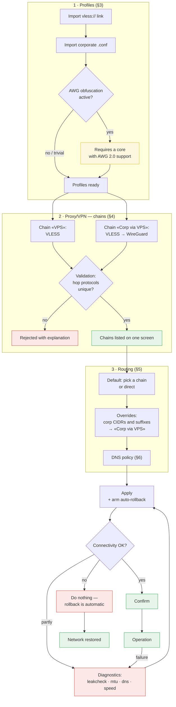

# FR — Functional Requirements

**Project:** TunnelChain (working name) — macOS application for VPN tunnel chains
**Related documents:** [AR.md](AR.md) · [ADR.md](ADR.md)

---

## 1. Purpose and scope

### 1.1 Problem

Stock macOS VPN clients (Hiddify, AmneziaWG.app, WireGuard.app) cannot operate together:

- each creates its own `utun` and its own default route — which one wins depends on start order;
- each rewrites the system DNS, overwriting whatever the previous one configured;
- `wg-quick` and NetworkExtension **must** exclude their own endpoint from the tunnel (otherwise a routing loop occurs), so nesting WireGuard inside another tunnel is impossible with two separate applications;
- an unclean shutdown leaves artifacts behind: a system proxy pointing at a dead port, a pinned DNS server, leftover `pf` rules.

### 1.2 What the application does

A single point of control for tunnel chains: one core process, one TUN interface, one owner of routes and DNS. The user describes **chains** (for example, a corporate WireGuard tunnel encapsulated inside VLESS REALITY) and **routing rules** (which traffic goes into which chain). The application generates the core configuration, brings the tunnel up, and monitors its state.

### 1.3 Out of scope

| Not included | Rationale |
|---|---|
| Subscription/server marketplace | The goal is chaining the user's own tunnels, not discovering public ones |
| iOS and Android | Require NetworkExtension/VpnService and Apple Developer Program membership |
| Own protocol implementations | An existing core is used (see [ADR-002](ADR.md#adr-002)) |
| Server-side setup | The user configures their own VPS |

### 1.4 Target user

An engineer who has both a personal VPS running VLESS REALITY and a corporate WireGuard/AmneziaWG tunnel, and wants to manage them from one place. Technically competent, but not required to memorise `sing-box` configuration syntax.

### 1.5 Primary user journey



Two aspects of this journey are fundamental. First, chains are created **before** and **independently of** routing: the user describes the available channels, then decides what goes where. Second, from any "not working" state the user returns to a working network without manual intervention (FR-24, FR-25), and diagnostics lead back to applying a configuration rather than into a dead end.

---

## 2. Requirement priorities

**MUST** — the product does not work without it · **SHOULD** — important for practical usability · **MAY** — desirable.

---

## 3. Connection profiles

### FR-1. VLESS import (MUST)

The application accepts a `vless://` link and parses it into a structured profile.

**Fields to parse:** `uuid`, `host`, `port`, `type` (transport), `security`, `sni`, `pbk` (Reality public key), `sid` (short id), `fp` (uTLS fingerprint), `flow`.

**Validation rules:**

- `security=reality` requires non-empty `pbk` and `sni` — otherwise reject with a clear message;
- `security=tls` without `sni` — substitute `host`;
- transports other than `tcp` are reported explicitly as unsupported (REALITY does not use them);
- the `pqv` parameter (post-quantum) is ignored with a warning: the core does not support it.

**Acceptance:** pasting a real link exported from Hiddify creates a profile with no manual field editing.

### FR-2. WireGuard / AmneziaWG import (MUST)

The application accepts a `wg-quick` format `.conf` file and parses the `[Interface]` and `[Peer]` sections.

**Fields:** `PrivateKey`, `Address`, `DNS`, `MTU`, `PublicKey`, `PresharedKey`, `Endpoint`, `AllowedIPs`, `PersistentKeepalive`.

**Required parsing behaviour:**

1. **Keys are case-insensitive**, values may contain spaces, comments (`#`, `;`) are stripped, CRLF is supported.
2. **The `DNS=` line mixes resolver addresses and search domains.** Anything that is not an IP address is a search domain. These must be extracted separately: without them, short names (`jira` instead of `jira.corp.local`) do not resolve. WireGuard.app does this automatically, and the behaviour must be reproduced.
3. **AmneziaWG obfuscation parameters** (`Jc`, `Jmin`, `Jmax`, `S1`–`S4`, `H1`–`H4`, `I1`–`I5`) are recognised and stored in the profile.

### FR-3. AWG obfuscation detection (MUST)

The application determines whether a configuration requires obfuscation and warns when the active core cannot provide it.

**"Obfuscation is active" criterion:** `Jc≠0`, or any of `S1`–`S4`≠0, or `H1..H4` differ from `1,2,3,4`, or any of `I1`–`I5` is set.

**Behaviour:** when obfuscation is active and the active core is the upstream `sing-box`, warn that the handshake will not complete and that a core with AWG 2.0 support is required (see [ADR-003](ADR.md#adr-003)). Allow the user to proceed deliberately.

**Rationale:** trivial values (`Jc=0`, `S1=S2=0`, `H1..H4=1,2,3,4`) appear in configurations that are in fact compatible with vanilla WireGuard, so they must not be blocked.

### FR-4. Secret storage (MUST)

Private keys, UUIDs and pre-shared keys are stored in the **macOS Keychain**, never in plain files. Generated core configuration files that contain secrets are created with mode `0600` in a private application directory.

Secrets never appear in: logs, exported diagnostic reports, or the UI in cleartext (masked with a reveal control).

---

## 4. Proxy/VPN — chains

The "Proxy/VPN" section and the "Routing" section (§5) are **independent**. This section describes only *how a channel is built*; where traffic goes is the subject of §5. This separation is fundamental — see [ADR-012](ADR.md#adr-012).

### FR-5. Chain as a first-class entity (MUST)

A chain is a named channel of one or more hops, where each subsequent hop is encapsulated inside the previous one. A chain is created, edited and deleted independently of routing rules and has no knowledge of which traffic will use it.

**Hop content:** a reference to a connection profile (§3). Hop order is significant: the first hop is the outermost (closest to the ISP), the last is the innermost (closest to the application).

Examples of valid chains:

| Chain | Hops | Purpose |
|---|---|---|
| «VPS» | VLESS | Ordinary internet egress through the user's own server |
| «Corp via VPS» | VLESS → WireGuard | Corporate network with WireGuard hidden from the ISP |
| «Corp direct» | WireGuard | Corporate network without obfuscation |

**Requirement:** a single-hop chain is a fully supported case, not a degenerate one. It is precisely what is used for ordinary internet egress.

### FR-6. Hop encapsulation (MUST)

For chains of two or more hops, the traffic of an inner hop — **including handshake initiation** — must travel inside the outer hop rather than directly.

```
Applications → WireGuard (encrypts first) → VLESS REALITY (encrypts second) → VPS → corporate WG server
```

**Acceptance:** `tcpdump` on the physical interface shows zero UDP packets to the inner hop's endpoint, while traffic to the outer hop is present.

### FR-7. Chains of arbitrary length (SHOULD)

The data model and configuration generator support N hops (`A → B → C`). Adding a third hop must not require a storage schema change.

### FR-8. Chain validation (MUST)

A chain is validated **before** it is saved, with a clear explanation on rejection.

| Rule | Rationale |
|---|---|
| **Hops must not share a protocol** | A `VLESS → VLESS` or `WG → WG` chain provides no benefit: a second layer of the same type doubles overhead while adding neither obfuscation nor access to a new network. Such a configuration is almost always user error |
| A profile must not appear twice in one chain | Degenerate case of the rule above |
| A chain must not reference itself, including transitively | Cycle protection |
| A chain must not be empty | — |
| Referenced profiles must exist | Referential integrity |

**Constraint and revision path.** Forbidding duplicate protocols also rules out "double VLESS through two different VPS hosts" (geo change plus an extra layer). Should that scenario be needed, the rule is relaxed to a warning conditional on the hops pointing at **different servers**. As specified, the restriction is a hard rejection that protects against meaningless configurations.

### FR-9. Chain overview screen (MUST)

All chains are listed on one screen. For each chain the following is shown:

- name and hop composition as a diagram (`VLESS → WG`);
- state: whether it is currently active, and whether any routing rule references it;
- result of the last reachability check (availability, latency);
- profile warnings — for example, active AWG obfuscation with a core that does not support it (FR-3).

**Note:** a chain referenced by no rule is displayed as inactive but is not an error — it may be a prepared alternative.

---

## 5. Routing

This section answers exactly one question: **which traffic goes into which chain**. There is no "VPN mode" concept — arrangements such as full-tunnel or split-tunnel are merely particular configurations of this section.

### FR-10. Default route (MUST)

One chain (or `direct`, meaning no tunnel) is designated as the destination for all traffic that matches no override.

**Changing the default chain is the only thing that distinguishes the familiar "modes":**

| User intent | Default | Overrides |
|---|---|---|
| Internet via VPS, corporate network via the corporate channel (**recommended**) | «VPS» (VLESS) | corp CIDRs and suffixes → «Corp via VPS» |
| All traffic through the corporate network | «Corp via VPS» | — (optionally exclusions for the local network) |
| Tunnel only for corporate resources | `direct` | corp CIDRs → «Corp via VPS» |

The application does **not** introduce modes as a separate entity: the user simply chooses a default. Presets (FR-12) merely populate this table on the user's behalf.

**Rationale for the recommended option:** see [ADR-005](ADR.md#adr-005) — designating a chain with nested WireGuard as the default produces TCP-over-TCP and instability.

### FR-11. Overrides (MUST)

An ordered list of rules. Each rule pairs a match condition with a chain (or `direct`) that matching traffic is sent to.

| Condition type | Example | Priority |
|---|---|---|
| IP CIDR | `10.0.0.0/8`, `172.20.0.0/16` | MUST |
| Domain suffix | `corp.internal`, `internal.example` | MUST |
| Port / port range | `53`, `5000-5100` | SHOULD |
| Process / application | `Docker`, `Slack` | MAY |
| Geolocation / rule set | `geoip:ru` | MAY |

**Requirements:**

- order is significant, visible to the user, and changed by drag-and-drop;
- a rule may target `direct` — that is what an exclusion is (for example `192.168.1.0/24` for the home LAN and printers), so no separate "exclusion" entity is needed;
- when a chain referenced by rules is deleted, the application warns and offers to reassign them;
- **auto-population:** on `.conf` import, the subnets from `AllowedIPs` are proposed as rules targeting the corresponding chain, and the address from `DNS=` is added automatically.

### FR-12. Routing presets (SHOULD)

Ready-made "default plus overrides" sets for common intents, so rules need not be assembled by hand:

| Preset | Effect |
|---|---|
| "Corporate access" | default = the VLESS chain; corp CIDRs and suffixes → the WireGuard chain |
| "Everything through the corporate network" | default = the WireGuard chain; warns about traffic visibility and TCP-over-TCP |
| "Corporate resources only" | default = `direct`; corp CIDRs → the WireGuard chain |

A preset is a "populate the configuration" operation, not a persistent mode: after applying it, the user sees and edits ordinary rules.

### FR-13. Kill switch (SHOULD)

If the core dies, traffic must not leak directly. Implementation is fail-closed: the system DNS remains pointed into the TUN and routes are not restored automatically. The user receives an explicit notification of the disruption.

The kill switch must be disableable in settings — on an unstable link it can be counterproductive.

---

## 6. DNS

### FR-14. Split DNS policy (MUST)

Three classes of query are handled by different resolvers:

| Class | Resolver | Path |
|---|---|---|
| Corporate suffixes plus reverse zones `*.in-addr.arpa` | the resolver from `.conf` (e.g. `10.0.0.53`) | through the inner hop (WireGuard) |
| Public domains | DoH (`1.1.1.1` by default, configurable) | through the outer hop (VLESS) |
| The VPS address itself | system resolver (bootstrap) | direct |

**The bootstrap resolver is mandatory.** Without it a circular dependency arises: VLESS waits for its own address to resolve while the resolver waits for VLESS. Resolving the inner hop's endpoint is done **through the outer hop** — no cycle exists there, because VLESS does not depend on WireGuard.

### FR-15. All-DNS-to-corporate option (SHOULD)

An option reproducing WireGuard.app behaviour: every query goes to the corporate resolver. Useful when the list of internal suffixes is unknown — internal names resolve without knowing it.

**Mandatory warning:** the corporate resolver will see the entire DNS history, including personal queries; moreover it may not cope with the volume. Measured on the prototype: 256 queries to a single advertising domain in one session, alongside 250 and 235 to others, producing `dns: exchange failed ... context canceled` and the impression that the internet had died.

### FR-16. DNS interception (MUST)

The system DNS points at an address inside the TUN, and queries are intercepted by the core.

**Implementation requirement:** interception is expressed as a rule matching **address and port** (`ip_cidr` plus `port: 53`), not solely by protocol detection. A "protocol = DNS" rule works only in combination with sniffing; without it, queries fall through to the default route and loop, and the browser reports `DNS_PROBE_FINISHED_BAD_CONFIG`. Verified on the prototype — this was a real regression.

### FR-17. Search domains (MUST)

Search domains (from `.conf` or entered manually) are written into the system network settings so that short names work. They are cleared on shutdown.

---

## 7. Diagnostics

Diagnostics are not an auxiliary feature but the product's core value: they are what distinguishes it from "yet another VPN client". Every check below is implemented in the prototype and proved necessary in practice.

### FR-18. Nesting verification (MUST)

A control that proves the chain is genuinely nested:

1. capture on the physical interface for UDP to the inner hop's endpoint — **must be silent**;
2. capture on the same interface for traffic to the outer hop — **must show traffic**;
3. a verdict in the UI: "nesting confirmed" or "direct UDP detected — nesting is broken".

### FR-19. MTU tuning (MUST)

Double encapsulation reduces the usable MTU. The application helps determine a working value.

**Arithmetic reference:** `1500 − IP 20 − TCP 20 − TLS 22 − VLESS/xudp ~16 = 1422`, minus WireGuard 32 = **1390 theoretical maximum**.

**Empirical fact (important):** 1390 **does not work** — small connections succeed while large transfers and TLS handshakes fail. The working value is **1280**. The application defaults to 1280 and allows lowering it (1200, 1150) with measurement.

**Symptom of an oversized MTU** that the application must recognise: small requests succeed, large downloads stall, `DNS_PROBE_FINISHED_BAD_CONFIG` appears in the browser.

### FR-20. Throughput measurement (MUST)

N download runs of a fixed size, reporting the average, the best result and **the number of failed runs**. The last figure is critical: an `HTTP 000` on a 10 MB download is the primary indicator of an unstable chain.

Measuring baseline throughput with the tunnel down, for comparison, is required.

### FR-21. DNS verification (MUST)

Resolution checks for public and corporate names, indicating which resolver answered. When corporate names fail, the application distinguishes two causes — unknown suffixes versus a dead path to the resolver — by issuing a control query directly to the corporate resolver.

### FR-22. System recovery — Doctor (MUST)

A single control that finds and removes artifacts left behind by any VPN client:

| Check | Why it is on the list |
|---|---|
| System proxy pointing at a dead port | **Real incident:** Hiddify left a proxy at `127.0.0.1:12334`; `ping` and `curl` worked while the browser and Postman failed |
| Pinned DNS with no core running | DNS points into a dead TUN |
| Leftover TUN routes | Routes to a non-existent interface |
| `pf` rules from the core | `strict_route` on macOS modifies the packet filter |
| Orphaned launchd daemon | Would start again after a reboot |

Each finding is presented in plain language with a "fix" action.

### FR-23. Logs and observability (SHOULD)

- Core log viewer with level filtering and search.
- Active connection list: destination, chain used, volume.
- Traffic graph.
- Diagnostic report export **with automatic secret redaction** — suitable for sending to a colleague or attaching to an issue.

---

## 8. Safety and recovery

### FR-24. Timed auto-rollback (MUST)

Applying a configuration arms a watchdog. If the user does not confirm connectivity within a configured interval (5 minutes by default), the configuration is rolled back automatically: the core is stopped and DNS, search domains, proxy settings and `pf` are restored.

**Rationale:** this is the only protection against "applied a configuration, lost connectivity, cannot fix it because there is no connectivity". The situation occurred repeatedly while debugging the prototype, and the watchdog resolved it.

**Requirements:**

- the watchdog runs as root and does not depend on the GUI process staying alive;
- confirmation is an explicit user action;
- the confirmation prompt shows a countdown and states plainly: "if connectivity is broken, do nothing — everything will be restored automatically".

### FR-25. Full reset of tunnel settings (MUST)

Two mechanisms sharing one implementation. Both must leave the system exactly as it was before the application ever ran.

**A. Explicit control — "Reset network settings".** Always available, including while disconnected and while the core is unreachable. It performs the following unconditionally, ignoring current internal state:

| Action | Detail |
|---|---|
| Stop the core | Terminate the process and unload the launchd job |
| Restore DNS | Reset resolvers and search domains to DHCP on every network service |
| Clear proxy settings | Web, secure web and SOCKS proxies off on every service; auto-discovery off |
| Remove `pf` rules | Drop the application's own anchor and reload the system ruleset |
| Remove leftover routes | Delete routes pointing at the application's TUN addresses |
| Flush DNS cache | `dscacheutil` plus a restart of the resolver daemon |
| Disarm the watchdog | Cancel any pending rollback |

**Idempotency requirement:** the control works correctly when nothing is running, when the core has already been killed, and when the previous session ended in a crash. It must never fail because "there is nothing to reset".

**B. Automatic reset on application quit.** Quitting performs the same sequence. The application must never leave a machine whose network configuration points at a tunnel that no longer exists.

**Distinction from the kill switch (FR-13):** the kill switch is fail-closed and deliberately prevents traffic from leaking when the core dies *unexpectedly*. Quitting is a *deliberate* action and must fail-open — restoring ordinary connectivity. Conflating the two is exactly what leaves users without internet.

**Additional requirements:**

- closing the last window is not quitting: the tunnel keeps running and the menu bar item remains (FR-30). The reset happens on Quit;
- if the reset cannot complete (a system call is refused), report precisely what remains and offer the equivalent manual commands;
- the helper performs the same sequence when it is itself unloaded, so an application crash cannot leave the network broken;
- the reset is logged, so its effect can be audited afterwards.

**Acceptance:** with an active tunnel, quit the application, then inspect `scutil --dns`, `scutil --proxy`, `netstat -rn` and `pfctl -s Anchors` — no trace of the application remains and browsing works.

### FR-26. Known-good configuration (SHOULD)

The application remembers the last confirmed configuration and can return to it in one action.

### FR-27. Conflicts with other VPN clients (MUST)

Before connecting, the application detects running instances of Hiddify, AmneziaWG or WireGuard, plus active system VPN profiles, and warns. After they are closed it **must** clear system proxy settings — such a client may fail to roll back its own settings (see FR-22).

The application does not attempt to operate alongside them and states so plainly.

---

## 9. Interface

### FR-28. Main screens (MUST)

Navigation mirrors the separation established in §4 and §5: "Proxy/VPN" answers *which channels exist*, "Routing" answers *what goes where*. These are two separate screens, not two tabs of one.

| Screen | Content |
|---|---|
| **Status** | Current state, external IP, diagram of the active chain, traffic, connect control |
| **Profiles** | Connection list (VLESS, WG), import, editing, compatibility warnings |
| **Proxy/VPN** | Chain list (FR-9). Creation and editing: hop composer with validation (FR-8), reachability check per chain |
| **Routing** | Default chain selector (FR-10) at the top, ordered override list with drag-and-drop below (FR-11), preset action (FR-12) |
| **DNS** | Resolution policy, corporate suffixes, search domains |
| **Diagnostics** | All checks from section 7, plus the reset control (FR-25) |
| **Logs** | Core log, active connections |

**Connectivity requirement:** from "Routing" the user can navigate to the chain a rule references, and from a chain screen see which rules use it.

### FR-29. Chain visualisation (SHOULD)

A diagram of the packet layers stating who sees what:

```
Application
 └─ WireGuard        — encrypts first; only the corporate server holds the key
     └─ VLESS/REALITY — encrypts second; only your VPS holds the key
         └─ TCP to VPS — all the ISP can see
```

Accompanied by plain-language notes: the ISP sees only TLS to the VPS; the VPS sees a UDP stream it cannot read; the corporate server decrypts and sees the traffic.

### FR-30. Menu bar item (SHOULD)

A status bar icon showing state, with a quick chain switch and connect/disconnect.

### FR-31. Design system (SHOULD)

The interface is built on a design system generated with the `ui-ux-pro-max` skill (MIT, supports Flutter). Requirements: dark and light themes, macOS-native spacing and typography, accessibility (contrast, hit target sizes).

---

## 10. Non-functional requirements

| Requirement | Value |
|---|---|
| Platform | macOS 13+ (Ventura is the minimum version providing `SMAppService`), Apple Silicon and Intel |
| Extensibility | Code is partitioned so the platform layer (privileges, TUN) can be replaced for Windows/Linux without rewriting the logic |
| Configuration apply time | < 5 s from action to a working tunnel |
| Idle footprint | < 100 MB RAM for the GUI; the core runs as a separate process |
| Failure recovery | The network returns to a working state automatically (FR-24, FR-25) |
| Localisation | English and Russian |
| Logs | Rotated, free of secrets |

---

## 11. Acceptance criteria

The product is complete when the following scenario passes on a clean macOS machine:

1. Import a `vless://` link and a corporate `.conf` — profiles are created with no manual editing.
2. Create two chains: «VPS» with one hop (VLESS) and «Corp via VPS» with two (VLESS → WireGuard). Both appear on the "Proxy/VPN" screen.
3. Attempt to create a chain of two VLESS hops — the application rejects it with an explanation (FR-8).
4. On "Routing", set default = «VPS» and add an override: corporate CIDRs and suffixes → «Corp via VPS».
5. Connect. The external IP is the VPS address. Corporate resources are reachable by name and by IP.
6. `leakcheck` confirms there is no direct UDP to the corporate endpoint.
7. Throughput measurement: all runs succeed and the result is comparable to a direct VLESS connection.
8. Change the default to «Corp via VPS» — the TCP-over-TCP and traffic-visibility warnings appear; apply, confirm the external IP is now the corporate one, then revert.
9. Kill the core process manually — the kill switch engages and a notification is shown.
10. Do not confirm a configuration — after 5 minutes the network returns to its previous state automatically.
11. Run Doctor on a system with a foreign leftover proxy — the problem is found and fixed.
12. Delete a chain referenced by a rule — the application warns and offers reassignment.
13. Press "Reset network settings" while connected — the core stops and DNS, search domains, proxy and `pf` return to their original state.
14. Quit the application with an active tunnel — the same reset happens automatically; `scutil --dns`, `scutil --proxy`, `netstat -rn` and `pfctl -s Anchors` show no trace, and browsing works.

---

## 12. Requirement provenance

Requirements FR-3, FR-14, FR-16, FR-17, FR-18, FR-19, FR-20, FR-22, FR-24, FR-25 and FR-27 derive from failures observed during early integration testing. Each is a real breakage rather than a hypothesis.
